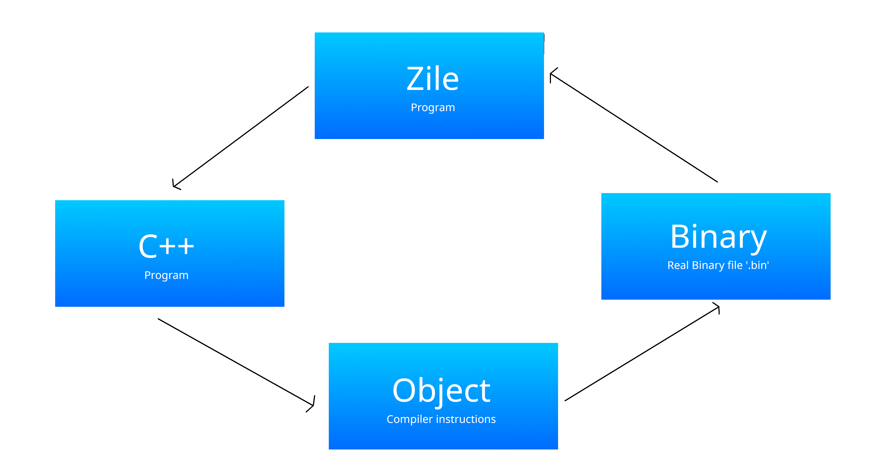

# ZILE-Language-Compiler
ZILE Is an OpenSource computer langage designed for system level coding only not for standaard application development and this is the official compiler for ZILE! 

## Developing an Application with zile lang
This is a misconception because zile is designed for system level programming only not for standard application development and zile is written mostly for string management and disk management because every zile program is too much lightweight for memory because zile heavily relies on the underlying main storage for executing its program which is why your system level program may always be good for performance

## Understanding Zile 0.1 BETA Compiler Toolchain
This flow chart will help you to understand about how Zile Compiles it self


As shown in the flow chart you can see the following steps.

:- Zile program is being readen by the zile compiler
:- Zile compiler will transpile the high level zile program into the high level C++ program
:- Zile will controll the generated C++ and instruct the clang++ compiler to compile the C++ into object.
:- After the object file is being created clang++ will create a real binary file for execution typically with '.bin' file extension

This was how Zile 0.1 BETA Compiles it self later versions can include some changes to the language and it's compilation process so make sure to only read the latest available documentation for zile lang.


## What was the first orignal Zile compiler written in?
The very first orignal zile compiler was written in C++ purely for compiling the zile 0.1 BETA Language version. This version ws officially written by ghgltggamer on 06/09/2024 at 04:41pm as a starting project ending time is mentioned inside the compiler's source code it self. This compiler was founded in India/Delhi.


## Why Zile is not for Application level programming
Zile is not for application level programming because Zile lacks so many common programming statements (Only for 0.1 BETA Later version may be compaitable for application level programming also) and Zile compiles into a real time binary file which can be used by any low level software for doing some specific tasks.


## Learning Zile
Learning Zile is a good option only when you want to explore some low level proggramming concepts othervise try to learn a different programming language.
Zile is also not beginer friendly means newbies to programming may find Zile too difficult to learn because Zile has a totaly different syntax from traditional programming languages Like C, C++ , python etc, And also Zile's syntax was inspired by Assembly languages so Zile can be overwhelming for newbies to programming.

But if you have choosen Zile for learning then here is the official and brief documentation on Zile.

## Exploring the Syntax of Zile lang 0.1 BETA
Zile 0.1 BETA has a unique syntax which is too close to CLI or ASM.

CLI :- Command Line Interface
ASM :- Assembly

Just like how you executed command in your command sector or terminal, Similarly you also writed ASM and Zile Program. These type of syntax is followed by MACROS of Zile.

## MACRO in Zile
A <code>MACRO</code> in Zile is used for performing an specific task and they only understands the parsed value to them and with parsed value you can not do any calculations for MACROS because once the values are parsed to MACROS they can not be reverted or recomputed as MACROS takes the whole line as content to parse resulting in no dynamic calculations.

### Parsing values to MACROS in Zile
Before you parse any value to any MACRO you need to understand that only the MACRO which allows values or need values after calling can take parsed values and a MACRO which doesnot allow value parsing will totaly ignore the parsed values resulting in no computing of parsed values, So be sure to check that does MACRO allows value parsing or not and then decide weather you need to parse the value or not and also it is compulsary to parse a value to the MACRO which ALLOWS value parsing or the C++ -> obj transpilation may stop compilation and result errors.

### How to parse the value to a MACRO
Parsing the values to a MACRO is pretty simple just write the macro name and then give a backspace and write the value what every you want to parse, and it may look like this.

```zile

[MACRO] [VALUE]

```

Here <code>[MACRO]</code> must be replaced by the Actual MACRO and [VALUE] must be replaced by the actuall value.


### Comments in Zile
Comments in Zile are one of the most important parts of Zile language because Comments are those lines which will be ignored by the Zile's Compiler during Compilation resulting in no changes due to them.

Comments can be only written in Zile with ';' charcter.

Write ';' and then write anything else you want because this will not affect the compilation aand wont parse any error.

Example
```zile

; Hey this is a comment
; This line will not affect the code

```

Here line started with ';' and then anything else has been parsed as comment.


## Learning some macros of Zile 0.1 BETA - Upgrade : Version
This version included the CO MACRO.

Note: every MACRO will be full-filled with capital charcters only which means that this is a MACRO.

### ALLOW [MACRO]
<code>ALLOW</code> MACRO allows some specific actions to be done with Zile, Means you can only permit the required actions resulting in high performance.

<code>ALLOW</code> allows value parsing and only 1 value can be assigned to <code>ALLOW</code> macro at a time.

List of Supported values or actions by ALLOW

*CIO* : Stands for Console Input & Output
*FIO* : Stands for File Input & Output
*DS* : Stands for Data Storer

Only actions from this list can be given to ALLOW macro.

Example
```zile

; We are allowing our program to perform Console Input & Output tasks
ALLOW CIO

```


### CMAIN [MACRO]
<code>CMAIN</code> MACRO is a important MACRO for Console Level Programming because this stands for <code>Console Main</code> which is the starting point of every Zile Console System Level Program without this MACRO Your program can not be started.

This MACRO Do not allows value parsing means no value is needed to be parsed to this MACRO Because it will be simply ignored.

Example
```zile

; Starting Code
CMAIN


```

### ECMAIN [MACRO]
<code>ECMAIN</code> ends the CMAIN MACRO and this is an important step because CMAIN needs to be closed or terminated so that it must be a valid C++ syntax without this MACRO You may get C++ -> obj transpilation errors and compilation may stop so use this MACRO to end that error. also you will write your code between CMAIN and ECMAIN MACROS so making them valid.

ECMAIN stands for End Console Main or End CMAIN

and ECMAIN also do not allows values parsing.

Example
```zile

; Starting block of code
CMAIN

; Your code goes here

ECMAIN

```


### OS [MACRO]
<code>OS</code> MACRO is used to perform System calls and used to execute System commands as system calls.

This MACRO do needs an Value because this MACRO allows value parsing and the value must be the command which must be executed by the System.

Example
```zile

CMAIN

; Executing ls command by terminal
OS ls

; Making a directory named myDir
OS mkdir myDir

; Just parse any command to OS MACRO and it will execute the command

ECMAIN

```


### CO [MACRO]
<code>CO</code> MACRO is used for Writting something on console and CO stands for 'Console Output', But this MACRO needs the program permission to work and for that you need to ALLOW , CIO Operations (Console Input & Output), This operations allows you to your CO (Console Output) for writting anything on console. 

CO Allows the value input means you need to parse the value which you want to write on Console.

Example
```zile
ALLOW CIO

CMAIN

; This will write Hellow world 2024 on the console
CO Hellow world 2024

; Writting the result of 7+8 on console
CO 7+8

; CO 7+8 will simple write 7+8 on console because CO is used for writting not for printing means as an standard MACRO of zile CO will write 7+8 as characters on console not the result of 7+8 because it's totaly different from printing.

ECMAIN

```


### OV [Concept]
<code>OV</code> stands for Output Vector which are a part of zile language because these were introduced by the zile language it self which stores some data on your non-voatile memory premanentaly and you can use this data anytime you want. Output Vector are special files called Vector Files in zile which are much robust and powerfull as compared to your normal files because vector files allows you to do quick data manipulation between infinite vector file for example replacing to files data completly , moving file data etc.

Example :-
```zile

;./root
;--/main.zile
;--/yourvector
;--/yourvectorfileetc

; You can manipulate both vector files or even more

```

Vector Files do not have a file extension and every file can become a vector file once it is parsed inside the zile program.


### COV [MACRO]
<code>COV</code> MACRO stands for Create Output Vector and is used for creating Output Vector files without any limit, COV can create infinite number of vector files based on program.

Syntax :-

COV [Vector File name]

Example
```zile
ALLOW CIO
ALLOW FIO
ALLOW DS

CMAIN

; This will create an output vector file
COV myVector

; Multiple vector file
COV 1
COV 2
COV 3

; These files will be stored in your real non-volatile memory

ECMAIN

```


### IOV [MACRO]
<code>IOV</code> MACRO stands for Input Output Vector File and is used for completly wiping the previous Vector File data and inserting new data to it .

Syntax :-

IOV [Vector file name],[Vector file data]

Example
```zile
ALLOW CIO
ALLOW FIO
ALLOW DS

CMAIN

; This will create an output vector file
COV myVector

; Inserting data to myVector where data is hellow world 2024
IOV myVector,Hellow world 2024

; Addign multiple lines to myVector
IOV myVector Hellow world 2024 \n New line

; \n stands for new line and it is a standard C++ escape sequence character

ECMAIN

```


### GOV [MACRO]
<code>GOV</code> MACRO stands for Get Output Vector File and is used for Fetching all the data of a Vector file and storing it in your volatile memory for the program until it exits. The data of Output Vector File can be accessed using GOV_VALUE and all the data stored in GOV can be released or removed by FREE_GOV macro

Syntax :-

GOV [Output Vector Name]

Example
```zile
ALLOW CIO
ALLOW FIO
ALLOW DS

CMAIN

; This will create an output vector file
COV myVector

; Inserting data to myVector where data is hellow world 2024
IOV myVector,Hellow world 2024

; Fetching data from GOV
GOV myVector

; Outputing vector data
CO GOV_VALUE

; Releasing GOV data
FREE_GOV

; \n stands for new line and it is a standard C++ escape sequence character

ECMAIN

```


### MOV [MACRO]
<code>MOV</code> MACRO stands for Move Output Vector File and is used for completly moving the vector file data from 1 file to another resulting in another file containing 1 file data and 1 file will be complely wiped out.

Syntax :-

MOV [Vector file name],[Target Vector name]

Example
```zile
ALLOW CIO
ALLOW FIO
ALLOW DS

CMAIN

; This will create output vector files
COV myVector
COV myVector2

; Inserting data to myVector where data is hellow world 2024
IOV myVector,Hellow world 2024
IOV myVector2,2nd file

; Moving data from myVector to myVector2
MOV myVector,myVector2

ECMAIN

```


### ROV [MACRO]
<code>ROV</code> MACRO stands for Replace Output Vector Files and is used for completly Replacing the data of 1 vector file with another vector file.
Syntax :-

ROV [Vector file name],[Target Vector name]

Example
```zile
ALLOW CIO
ALLOW FIO
ALLOW DS

CMAIN

; This will create output vector files
COV myVector
COV myVector2

; Inserting data to myVector where data is hellow world 2024
IOV myVector,Hellow world 2024
IOV myVector2,2nd file

; Replacing data from myVector to myVector2
ROV myVector,myVector2

ECMAIN

```

Note :- MOV and ROV relies on IOV and GOV for Functioning in the backend means these are not independent MACROS where COV, IOV, GOV are completly independent macros. and for using Output Vector files you need to allow CIO, FIO and DS with the help of ALLOW MACRO. and COV, IOV, GOV , MOV, ROV are very fast and efficient because they barely utilises volatile memory for preventing memory leaks 


CO -> was later added to zile in Zile 0.1 BETA - Upgrade version
FIO, DS -> were later added to zile in Zile 0.1 BETA TEST 2 - Upgrade version

## Ending of the documentation
This documentation will give you every aspect of Zile language in depth.

-----------------------------End----------------------------------

                Written by :: GHGL TG GAMER
                        on :: 07/09/2024, 04:08pmm india/delhi
                Updated on :: 25/09/2024, 11:18am india/delhi

------------------------------------------------------------------
